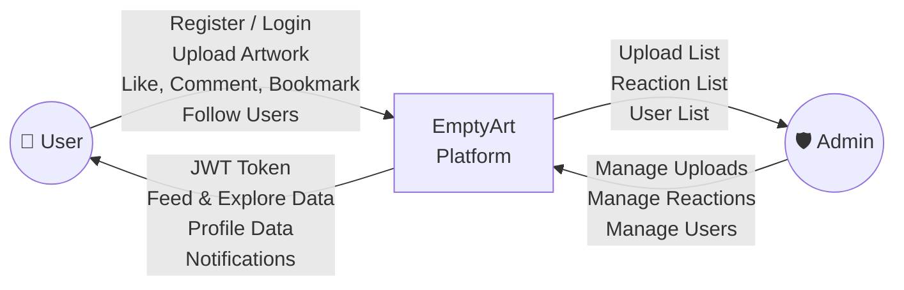
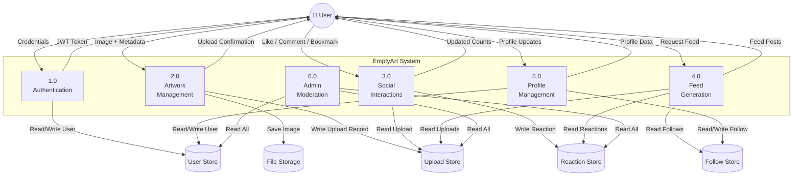
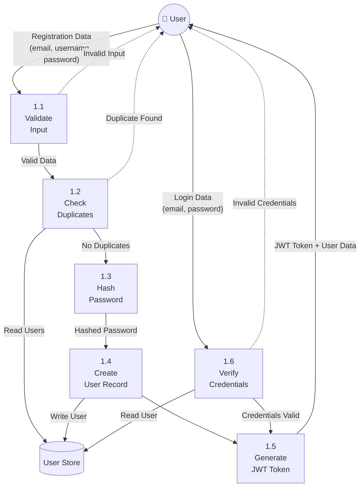

# Data Flow Diagram — EmptyArt

These diagrams show how data flows through the EmptyArt system for key operations.

## Level 0 — Context Diagram

## Level 1 — Main Processes

## Level 2 — Authentication Process Detail

## Data Flow Summary

| Flow                | Source           | Destination      | Data                                      |
| ------------------- | ---------------- | ---------------- | ----------------------------------------- |
| Registration        | User (Browser)   | Auth Service     | Email, username, password                 |
| Login               | User (Browser)   | Auth Service     | Email, password                           |
| Token Response      | Auth Service     | User (Browser)   | JWT token, user role, user data           |
| Upload Artwork      | User (Browser)   | Upload Service   | Image file, title, description            |
| Store Image         | Upload Service   | File System      | Image binary data                         |
| Save Upload Record  | Upload Service   | SQLite DB        | image_url, title, description, user_id    |
| Like/Bookmark       | User (Browser)   | Reaction Service | upload_id, reaction type                  |
| Add Comment         | User (Browser)   | Reaction Service | upload_id, comment text                   |
| Feed Request        | User (Browser)   | Feed Service     | JWT token (identifies user)               |
| Feed Response       | Feed Service     | User (Browser)   | List of uploads from followed users       |
| Follow/Unfollow     | User (Browser)   | User Service     | target user_id                            |
| Profile Update      | User (Browser)   | User Service     | bio, username, avatar image               |
| Admin Moderation    | Admin (Browser)  | Admin Service    | Action type + target resource ID          |
