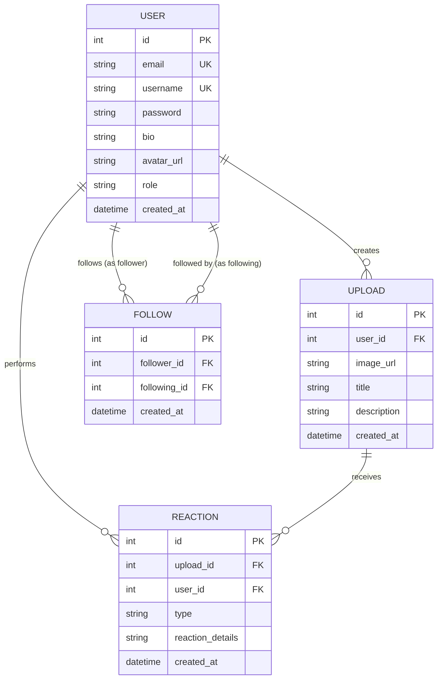

# Entity-Relationship Diagram — EmptyArt

This diagram represents the database schema showing all entities (tables), their attributes, and relationships.

## Entity Descriptions

### User
The central entity representing a platform user. Each user has a unique email and username, a hashed password, an optional bio and avatar, and a role that is either `"user"` or `"admin"`. The `created_at` timestamp records when the account was created.

### Upload
Represents an artwork posted by a user. Each upload contains an image file path (`image_url`), a title, an optional description, and is linked back to its author via `user_id`. Deleting an upload cascades to delete all associated reactions.

### Reaction
A polymorphic entity representing user interactions with uploads. The `type` field determines the kind of reaction:
- **`"like"`** — A like on an upload. Unique per (user_id, upload_id, type).
- **`"comment"`** — A text comment. The content is stored in `reaction_details`.
- **`"bookmark"`** — A saved artwork. Unique per (user_id, upload_id, type).

### Follow
Represents a follower relationship between two users. `follower_id` is the user who follows, and `following_id` is the user being followed. The pair (follower_id, following_id) is unique to prevent duplicate follows.

## Relationship Summary

| Relationship             | Type       | Description                                          |
| ------------------------ | ---------- | ---------------------------------------------------- |
| User → Upload            | One-to-Many | A user can create many uploads.                      |
| User → Reaction          | One-to-Many | A user can perform many reactions.                   |
| Upload → Reaction        | One-to-Many | An upload can receive many reactions.                |
| User → Follow (follower) | One-to-Many | A user can follow many other users.                  |
| User → Follow (following)| One-to-Many | A user can be followed by many users.                |

## Constraints

- **Unique constraint** on `(user_id, upload_id, type)` for likes and bookmarks — ensures a user can only like or bookmark an upload once.
- **Unique constraint** on `(follower_id, following_id)` — prevents duplicate follow relationships.
- **Cascade delete** on Upload → Reaction — deleting an upload removes all its likes, comments, and bookmarks.
