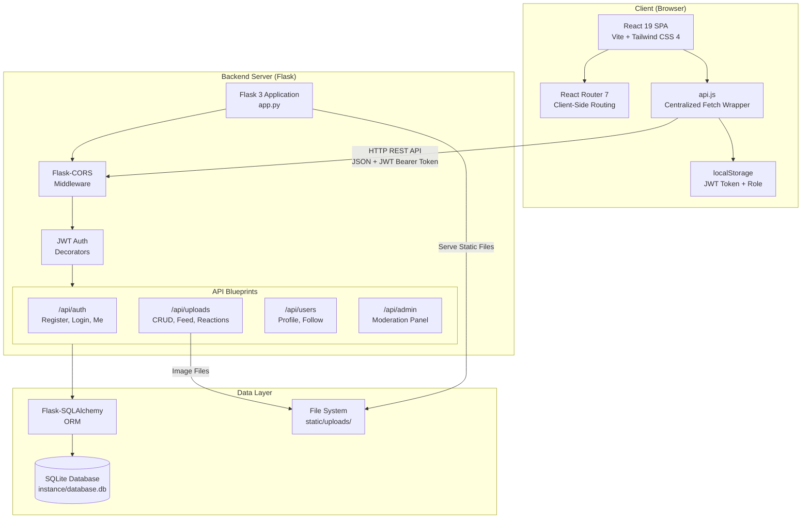

# System Architecture Diagram — EmptyArt

This diagram shows the high-level architecture of the EmptyArt platform, illustrating how the frontend, backend, and database layers communicate.

## Layer Descriptions

### Client Layer (Frontend)
| Component        | Technology               | Responsibility                                        |
| ---------------- | ------------------------ | ----------------------------------------------------- |
| React SPA        | React 19 + Vite          | Renders the UI, manages component state               |
| Router           | React Router 7           | Client-side navigation between pages                  |
| API Wrapper      | Custom `api.js`          | Centralized HTTP requests with automatic JWT injection |
| Token Storage    | localStorage             | Stores JWT token and user role client-side             |

### Server Layer (Backend)
| Component        | Technology               | Responsibility                                        |
| ---------------- | ------------------------ | ----------------------------------------------------- |
| Flask App        | Flask 3                  | Application factory, configuration, blueprint registration |
| CORS Middleware  | Flask-CORS               | Allows cross-origin requests from the frontend        |
| Auth Middleware  | PyJWT + Custom Decorators| Validates JWT tokens, enforces role-based access      |
| Auth Blueprint   | `/api/auth`              | User registration, login, session management          |
| Uploads Blueprint| `/api/uploads`           | Artwork CRUD, feed generation, reactions              |
| Users Blueprint  | `/api/users`             | Profile management, follow system                     |
| Admin Blueprint  | `/api/admin`             | Content moderation, user role management              |

### Data Layer
| Component        | Technology               | Responsibility                                        |
| ---------------- | ------------------------ | ----------------------------------------------------- |
| Database         | SQLite                   | Persistent storage for users, uploads, reactions, follows |
| ORM              | Flask-SQLAlchemy         | Object-relational mapping for database models         |
| File Storage     | Local File System        | Stores uploaded artwork images in `static/uploads/`   |

## Communication Flow

1. **User interacts** with the React SPA in the browser.
2. **React calls** `api.js` which attaches the JWT token from localStorage to each request.
3. **HTTP request** is sent to the Flask backend (typically `http://localhost:5000`).
4. **Flask-CORS** validates the origin and allows/blocks the request.
5. **Auth decorators** (`@login_required`, `@admin_required`) verify the JWT token and check roles.
6. **Blueprint handler** processes the request, interacts with SQLAlchemy models.
7. **SQLAlchemy** reads from or writes to the SQLite database.
8. **Response** (JSON) is returned to the frontend for rendering.
