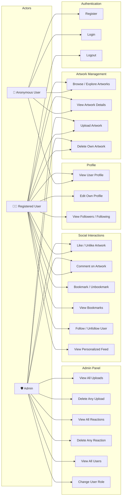

# Use Case Diagram — EmptyArt

This diagram illustrates the interactions between the three actor types (Anonymous User, Registered User, Admin) and the system's key features.

## Use Case Descriptions

| Use Case ID | Name                    | Actor(s)          | Description                                                                 |
| ----------- | ----------------------- | ----------------- | --------------------------------------------------------------------------- |
| UC-1        | Register                | Anonymous         | Create a new account with email, username, and password.                     |
| UC-2        | Login                   | Anonymous         | Authenticate using email/password to receive a JWT token.                    |
| UC-3        | Logout                  | Registered        | Clear JWT token from local storage to end the session.                       |
| UC-4        | Browse / Explore        | All               | View paginated list of all artworks on the platform.                        |
| UC-5        | View Artwork Details    | All               | Open a lightbox modal showing the artwork, author, likes, and comments.     |
| UC-6        | Upload Artwork          | Registered, Admin | Upload an image file with title and description.                            |
| UC-7        | Delete Own Artwork      | Registered, Admin | Remove an artwork the user has uploaded.                                    |
| UC-8        | Like / Unlike           | Registered, Admin | Toggle a like on an artwork.                                                |
| UC-9        | Comment                 | Registered, Admin | Post a text comment on an artwork.                                          |
| UC-10       | Bookmark / Unbookmark   | Registered        | Save or unsave an artwork to the user's vault.                              |
| UC-11       | View Bookmarks          | Registered        | View all bookmarked artworks in "The Vault".                                |
| UC-12       | Follow / Unfollow       | Registered        | Toggle follow relationship with another user.                               |
| UC-13       | View Feed               | Registered        | View uploads from followed users in a personalized feed.                    |
| UC-14       | View User Profile       | All               | View a user's profile page with upload grid and follower counts.            |
| UC-15       | Edit Profile            | Registered        | Update bio, username, and avatar.                                           |
| UC-16       | View Followers/Following| Registered        | View the list of a user's followers or who they follow.                     |
| UC-17       | View All Uploads        | Admin             | Access a list of all uploads on the platform from the admin dashboard.      |
| UC-18       | Delete Any Upload       | Admin             | Remove any upload regardless of ownership.                                  |
| UC-19       | View All Reactions      | Admin             | See all likes, comments, and bookmarks across the platform.                 |
| UC-20       | Delete Any Reaction     | Admin             | Remove any reaction from the platform.                                      |
| UC-21       | View All Users          | Admin             | See a list of all registered users and their roles.                         |
| UC-22       | Change User Role        | Admin             | Promote or demote a user's role (cannot change own role).                   |
